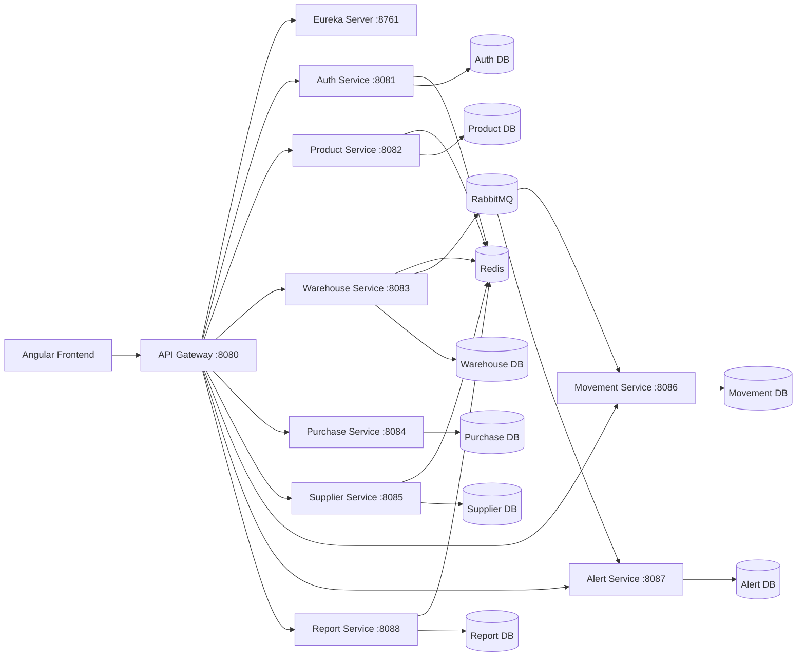

# StockPro Backend

[](https://www.oracle.com/java/)
[](https://spring.io/projects/spring-boot)
[](https://spring.io/projects/spring-cloud)
[](https://www.postgresql.org/)
[](https://www.rabbitmq.com/)

StockPro Backend is a microservices-based inventory management API built with Spring Boot and Spring Cloud. It handles authentication, product and supplier master data, warehouse stock operations, purchase orders, stock movement tracking, alerts, and reporting.

The system uses an API Gateway as the single entry point, Eureka for service discovery, PostgreSQL as the persistence layer, Redis for caching and JWT blacklist checks, and RabbitMQ for asynchronous inventory events.

## Contents

- [Architecture](#architecture)
- [Features](#features)
- [Tech Stack](#tech-stack)
- [Services](#services)
- [Repository Structure](#repository-structure)
- [Data and Messaging](#data-and-messaging)
- [API Overview](#api-overview)
- [Getting Started](#getting-started)
- [Configuration](#configuration)
- [Testing](#testing)
- [Security Notes](#security-notes)

## Architecture



## Features

- JWT authentication with login, registration, logout, token refresh, profile management, and password reset
- API Gateway routing with centralized JWT validation and downstream identity headers
- Product catalogue management with SKU, barcode, category, brand, pricing, reorder level, and active status
- Supplier management with contact details, location filters, rating updates, activation, and deactivation
- Warehouse management with stock initialization, stock update, reserve, release, transfer, and low-stock lookup
- Purchase order workflow with create, submit, approve, reject, receive, cancel, update, and filtering
- Stock movement audit trail for stock-in, stock-out, transfer, adjustment, and reference-based history
- Alert workflow for low stock, overstock, read state, acknowledgement, and email notifications
- Reporting APIs for inventory snapshots, stock value, turnover, low stock, top moving, slow moving, dead stock, and PO summary
- Service discovery, native configuration, health endpoints, Feign clients, Redis caching, RabbitMQ events, and Resilience4j fault tolerance

## Tech Stack

| Area | Technology |
| --- | --- |
| Language | Java 17 |
| Framework | Spring Boot 3.2.0 |
| Cloud stack | Spring Cloud 2023.0.0 |
| API entry point | Spring Cloud Gateway |
| Service discovery | Netflix Eureka |
| Configuration | Spring Cloud Config Server |
| Persistence | Spring Data JPA, PostgreSQL |
| Cache/session support | Redis |
| Messaging | RabbitMQ |
| Service clients | OpenFeign |
| Fault tolerance | Resilience4j |
| Security | Spring Security, JWT |
| Build tool | Maven |

## Services

| Service | Port | Purpose |
| --- | ---: | --- |
| `api-gateway` | 8080 | Request routing, CORS, JWT validation |
| `auth-service` | 8081 | Users, login, registration, JWT, password reset |
| `product-service` | 8082 | Product catalogue and product lookups |
| `warehouse-service` | 8083 | Warehouses, stock levels, reserves, transfers |
| `purchase-service` | 8084 | Purchase order lifecycle and goods receipt |
| `supplier-service` | 8085 | Supplier profiles, search, ratings |
| `movement-service` | 8086 | Stock movement history and audit trail |
| `alert-service` | 8087 | Inventory alerts and email notifications |
| `report-service` | 8088 | Inventory analytics and reporting |
| `eureka-server` | 8761 | Service registry |
| `config-server` | 8888 | Native configuration server |

## Repository Structure

```text
stockpro-backend/
  api-gateway/
  auth-service/
  product-service/
  warehouse-service/
  purchase-service/
  supplier-service/
  movement-service/
  alert-service/
  report-service/
  eureka-server/
  config-server/
  docker/
  docker-compose.yml
```

Each Spring Boot service is an independent Maven project with its own source code, tests, dependencies, and profile-specific configuration.

## Data and Messaging

### Databases

StockPro follows a database-per-service pattern.

| Service | Database |
| --- | --- |
| Auth | `stockpro_auth_db` |
| Product | `stockpro_product_db` |
| Warehouse | `stockpro_warehouse_db` |
| Purchase | `stockpro_purchase_db` |
| Supplier | `stockpro_supplier_db` |
| Movement | `stockpro_movement_db` |
| Alert | `stockpro_alert_db` |
| Report | `stockpro_report_db` |

### RabbitMQ

| Item | Value |
| --- | --- |
| Exchange | `stockpro.exchange` |
| Movement queue | `stock.movement.queue` |
| Movement routing key | `stock.movement.#` |
| Alert queue | `stock.alert.queue` |
| Alert routing key | `stock.alert.#` |

`warehouse-service` publishes stock movement and alert events. `movement-service` stores the movement audit trail, and `alert-service` creates user-facing inventory alerts.

## API Overview

All external API calls should go through the gateway:

```text
http://localhost:8080
```

| Route | Service |
| --- | --- |
| `/api/auth/**` | `auth-service` |
| `/api/products/**` | `product-service` |
| `/api/warehouses/**` | `warehouse-service` |
| `/api/stock/**` | `warehouse-service` |
| `/api/purchase-orders/**` | `purchase-service` |
| `/api/suppliers/**` | `supplier-service` |
| `/api/movements/**` | `movement-service` |
| `/api/alerts/**` | `alert-service` |
| `/api/reports/**` | `report-service` |

Public authentication routes:

- `POST /api/auth/login`
- `POST /api/auth/register`
- `POST /api/auth/forgot-password`
- `POST /api/auth/reset-password`
- `POST /api/auth/refresh`

Protected routes require:

```http
Authorization: Bearer <jwt-token>
```

After validation, the gateway forwards these identity headers to downstream services:

- `X-User-Id`
- `X-User-Email`
- `X-User-Role`

<details>
<summary>Endpoint groups</summary>

### Auth

- `POST /api/auth/register`
- `POST /api/auth/login`
- `POST /api/auth/validate`
- `POST /api/auth/refresh`
- `POST /api/auth/logout`
- `GET /api/auth/users`
- `GET /api/auth/profile/{id}`
- `PUT /api/auth/profile/{id}`
- `PUT /api/auth/password/{id}`
- `POST /api/auth/forgot-password`
- `POST /api/auth/reset-password`
- `PUT /api/auth/deactivate/{id}`
- `PUT /api/auth/activate/{id}`

### Products

- `POST /api/products`
- `GET /api/products/all`
- `GET /api/products/{id}`
- `GET /api/products/sku/{sku}`
- `GET /api/products/category/{category}`
- `GET /api/products/brand/{brand}`
- `GET /api/products/barcode/{barcode}`
- `GET /api/products/search`
- `GET /api/products/low-stock`
- `PUT /api/products/{id}`
- `PUT /api/products/deactivate/{id}`
- `PUT /api/products/activate/{id}`
- `DELETE /api/products/{id}`

### Warehouses and Stock

- `POST /api/warehouses`
- `GET /api/warehouses`
- `GET /api/warehouses/{id}`
- `PUT /api/warehouses/{id}`
- `PUT /api/warehouses/deactivate/{id}`
- `PUT /api/warehouses/activate/{id}`
- `POST /api/stock/initialize`
- `GET /api/stock/{warehouseId}/{productId}`
- `GET /api/stock/warehouse/{warehouseId}`
- `GET /api/stock`
- `PUT /api/stock/update`
- `POST /api/stock/reserve`
- `POST /api/stock/release`
- `POST /api/stock/transfer`
- `GET /api/stock/low`

### Purchase Orders

- `POST /api/purchase-orders`
- `POST /api/purchase-orders/{id}/submit`
- `POST /api/purchase-orders/{id}/approve`
- `POST /api/purchase-orders/{id}/reject`
- `POST /api/purchase-orders/{id}/receive`
- `POST /api/purchase-orders/{id}/cancel`
- `PUT /api/purchase-orders/{id}`
- `GET /api/purchase-orders`
- `GET /api/purchase-orders/{id}`
- `GET /api/purchase-orders/{id}/lines`
- `GET /api/purchase-orders/supplier/{supplierId}`
- `GET /api/purchase-orders/status/{status}`
- `GET /api/purchase-orders/warehouse/{warehouseId}`
- `GET /api/purchase-orders/date-range`

### Suppliers

- `POST /api/suppliers`
- `GET /api/suppliers`
- `GET /api/suppliers/active`
- `GET /api/suppliers/{id}`
- `GET /api/suppliers/search`
- `GET /api/suppliers/city/{city}`
- `GET /api/suppliers/country/{country}`
- `PUT /api/suppliers/{id}`
- `PUT /api/suppliers/{id}/rating`
- `PUT /api/suppliers/{id}/deactivate`
- `PUT /api/suppliers/{id}/activate`
- `DELETE /api/suppliers/{id}`

### Movements

- `POST /api/movements`
- `GET /api/movements/all`
- `GET /api/movements/product/{id}`
- `GET /api/movements/warehouse/{id}`
- `GET /api/movements/type/{type}`
- `GET /api/movements/date-range`
- `GET /api/movements/history/{productId}/{warehouseId}`
- `GET /api/movements/reference/{referenceId}/{referenceType}`
- `GET /api/movements/stock-in/{productId}`
- `GET /api/movements/stock-out/{productId}`

### Alerts

- `POST /api/alerts`
- `POST /api/alerts/bulk`
- `POST /api/alerts/low-stock`
- `POST /api/alerts/overstock`
- `GET /api/alerts`
- `GET /api/alerts/recipient/{recipientId}`
- `GET /api/alerts/unread-count/{recipientId}`
- `GET /api/alerts/unacknowledged/{recipientId}`
- `PUT /api/alerts/{id}/read`
- `PUT /api/alerts/read-all/{recipientId}`
- `PUT /api/alerts/{id}/acknowledge`
- `DELETE /api/alerts/{id}`

### Reports

- `POST /api/reports/snapshot/{warehouseId}`
- `POST /api/reports/snapshot/all`
- `GET /api/reports/snapshot/{warehouseId}`
- `GET /api/reports/stock-value/total`
- `GET /api/reports/stock-value/warehouse/{warehouseId}`
- `GET /api/reports/turnover/{warehouseId}`
- `GET /api/reports/low-stock`
- `GET /api/reports/top-moving`
- `GET /api/reports/slow-moving`
- `GET /api/reports/dead-stock`
- `GET /api/reports/po-summary`

</details>

## Getting Started

### Prerequisites

- JDK 17
- Maven 3.9+
- PostgreSQL 14+
- Docker Desktop, recommended for Redis and RabbitMQ

### 1. Clone the repository

```bash
git clone <repository-url>
cd stockpro-backend
```

### 2. Start infrastructure

The current compose file starts Redis and RabbitMQ.

```bash
docker compose up -d
```

RabbitMQ management console:

```text
http://localhost:15672
```

The local Docker compose file uses RabbitMQ's default development credentials. Change them before using the project outside local development.

### 3. Create PostgreSQL databases

```sql
CREATE DATABASE stockpro_auth_db;
CREATE DATABASE stockpro_product_db;
CREATE DATABASE stockpro_warehouse_db;
CREATE DATABASE stockpro_purchase_db;
CREATE DATABASE stockpro_supplier_db;
CREATE DATABASE stockpro_movement_db;
CREATE DATABASE stockpro_alert_db;
CREATE DATABASE stockpro_report_db;
```

### 4. Set local environment variables

Linux/macOS:

```bash
export SPRING_DATASOURCE_USERNAME=<db-user>
export SPRING_DATASOURCE_PASSWORD=<db-password>
export SPRING_DATA_REDIS_HOST=localhost
export SPRING_DATA_REDIS_PORT=6379
export SPRING_RABBITMQ_HOST=localhost
export SPRING_RABBITMQ_USERNAME=<rabbitmq-user>
export SPRING_RABBITMQ_PASSWORD=<rabbitmq-password>
export JWT_SECRET=<strong-256-bit-secret>
export SPRING_MAIL_USERNAME=<smtp-username>
export SPRING_MAIL_PASSWORD=<smtp-password>
```

Windows PowerShell:

```powershell
$env:SPRING_DATASOURCE_USERNAME="<db-user>"
$env:SPRING_DATASOURCE_PASSWORD="<db-password>"
$env:SPRING_DATA_REDIS_HOST="localhost"
$env:SPRING_DATA_REDIS_PORT="6379"
$env:SPRING_RABBITMQ_HOST="localhost"
$env:SPRING_RABBITMQ_USERNAME="<rabbitmq-user>"
$env:SPRING_RABBITMQ_PASSWORD="<rabbitmq-password>"
$env:JWT_SECRET="<strong-256-bit-secret>"
$env:SPRING_MAIL_USERNAME="<smtp-username>"
$env:SPRING_MAIL_PASSWORD="<smtp-password>"
```

### 5. Start services

Recommended startup order:

1. `eureka-server`
2. `config-server`
3. `auth-service`
4. `product-service`
5. `warehouse-service`
6. `supplier-service`
7. `purchase-service`
8. `movement-service`
9. `alert-service`
10. `report-service`
11. `api-gateway`

Start each service from its own directory:

```bash
cd eureka-server
mvn spring-boot:run
```

### 6. Verify

```text
Eureka Dashboard: http://localhost:8761
Gateway Health:   http://localhost:8080/actuator/health
```

## Configuration

Each service includes:

- `application.properties`
- `application-local.properties`
- `application-docker.properties`

The default profile is `local` for most services. Docker profile files use Docker network hostnames such as `eureka-server`, `redis`, `rabbitmq`, and `postgres`.

The config server uses native configuration files from:

```text
config-server/src/main/resources/configs
```

## Testing

Run tests for one service:

```bash
cd product-service
mvn test
```

Run tests across Maven service directories with PowerShell:

```powershell
Get-ChildItem -Directory | Where-Object { Test-Path (Join-Path $_.FullName "pom.xml") } | ForEach-Object {
  Push-Location $_.FullName
  mvn test
  Pop-Location
}
```

## Security Notes

- Keep database passwords, JWT secrets, SMTP credentials, and third-party keys out of Git.
- Use environment variables or a secret manager for sensitive values.
- Replace default RabbitMQ credentials outside local development.
- Remove Maven `target/` build output before publishing the repository.
- Review IDE files such as `.idea/` before committing.

## License

Add a license file before publishing if this project will be shared publicly.


### AUTHOR
Saket Mishra
